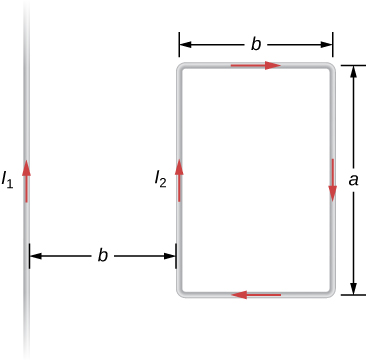

# {{ params.vars.title }}
The inifinite, straight wire shown in the figure carries a current $I_1$.
The rectangular loop, whose long sides are parallel to the wire, carries a current $I_2$.

## Part 1

Find an expression for the magnitude of the force on the rectangular loop due to the magnetic field of the wire.

You may copy and paste the Greek character μ0 into you symbolic expression.
Use `pi` to represent π.

### Answer Section

## Part 2

What is the direction of the net force on the rectangular loop due to the magnetic field of the wire?

### Answer Section

- {{ params.part2.ans1.value }}
- {{ params.part2.ans2.value }}
- {{ params.part2.ans3.value }}
- {{ params.part2.ans4.value }}

## Attribution

Problem is from the [OpenStax University Physics Volume 2](https://openstax.org/details/books/university-physics-volume-2) textbook, licensed under the [CC-BY 4.0 license](https://creativecommons.org/licenses/by/4.0/). 