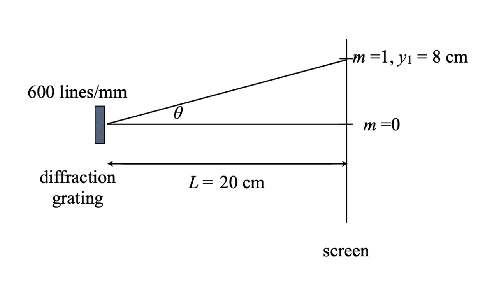

# {{ params_vars_title }}
You measure an atomic emission line to be 8.00 cm from the central diffraction maximum using a diffraction grating with 600.0 lines/mm held at a distance of 20.0 cm from the screen, as shown below.

## Part 1

The wavelength of this light is:

### Answer Section

- {{ params_part1_ans1_value }} {{ params_vars_units}}
- {{ params_part1_ans2_value }} {{ params_vars_units}}
- {{ params_part1_ans3_value }} {{ params_vars_units}}
- {{ params_part1_ans4_value }} {{ params_vars_units}}
- {{ params_part1_ans5_value }} {{ params_vars_units}}

## Attribution

Problem is licensed under the [CC-BY-NC-SA 4.0 license](https://creativecommons.org/licenses/by-nc-sa/4.0/).  