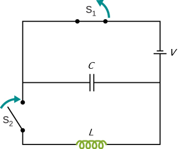

# {{ params.vars.title }}
Consider the switched $LC$ circuit shown below.

Consider the case that $\rm S_1$ is opened and $\rm S_2$ is closed simultaneously.
Here, $V = {{ params.V }}\rm\ V$, $L = {{ params.L }}\rm\ mH$, and $C = {{ params.C }}\rm\ \mu F$.

## Part 1

What is the frequency of the resulting oscillations?

### Answer Section

Please enter in a numeric value in $\rm\ Hz$.

## Part 2

What is the maximum charge on the capacitor?

### Answer Section

Please enter in a numeric value in $\rm\ C$.

## Part 3

What is the maximum current through the inductor?

### Answer Section

Please enter in a numeric value in $\rm\ A$.

### pl-submission-panel

{{ feedback.part1_ans }} 
{{ feedback.part2_ans }} 
{{ feedback.part3_ans }}

### pl-answer-panel

$f=$ {{ correct_answers.part1_ans_str }} $\rm\ Hz$ 
$Q\_{C, \rm\ max}=$ {{ correct_answers.part2_ans_str }} $\rm\ C$ 
$I\_{L, \rm\ max}=$ {{ correct_answers.part3_ans_str }} $\rm\ A$

## Attribution

Problem is from the [OpenStax University Physics Volume 2](https://openstax.org/details/books/university-physics-volume-2) textbook, licensed under the [CC-BY 4.0 license](https://creativecommons.org/licenses/by/4.0/). 