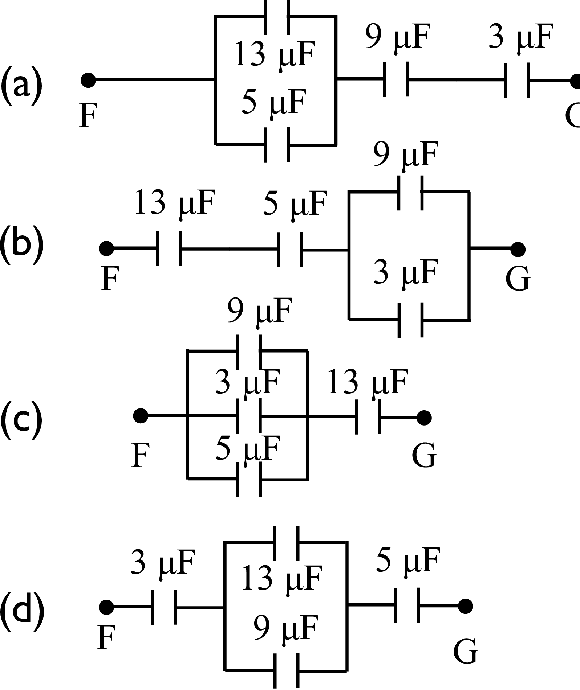

# {{ params.vars.title }}

## Part 1

Which of the circuits shown in figure above (made up of one each of a 3$\mu$F, 5$\mu$F, 9$\mu$F and 13$\mu$F capacitors) has an effective capacitance between points F and G of $2.0 \mu$F?

### Answer Section

- {{ params.part1.ans1.value }} {{ params.vars.units}}
- {{ params.part1.ans2.value }} {{ params.vars.units}}
- {{ params.part1.ans3.value }} {{ params.vars.units}}
- {{ params.part1.ans4.value }} {{ params.vars.units}}
- {{ params.part1.ans5.value }} {{ params.vars.units}}

## Attribution

Problem is licensed under the [CC-BY-NC-SA 4.0 license](https://creativecommons.org/licenses/by-nc-sa/4.0/).  