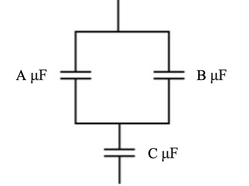

# {{ params.vars.title }}

## Question Text

Find the total capacitance of this combination of series and parallel capacitors shown below. Use the following values: $A =$ {{params.a }}, $B =$ {{params.b }}, and $C =$ {{params.c }}.

### Answer Section

### pl-submission-panel

{{ submitted_answers.part1_ans_str }}

{{ feedback.part1_ans }}

### pl-answer-panel

$C=$ {{ correct_answers.part1_ans_str }} $\rm\ \mu\textrm{F}$

## Attribution

Problem is from the [OpenStax University Physics Volume 2](https://openstax.org/details/books/university-physics-volume-2) textbook, licensed under the [CC-BY 4.0 license](https://creativecommons.org/licenses/by/4.0/). 