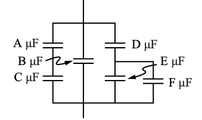

# {{ params.vars.title }}

## Question Text

Find the net capacitance of this combination of series and parallel capacitors shown below. Use the following values: $A = ${{params.a }}, $B =$ {{params.b }}, $C =$ {{params.c }}, $D =$ {{params.d }}, $E =$ {{params.e }}, and $F =$ {{params.f }}.

### Answer Section

## Attribution

Problem is from the [OpenStax University Physics Volume 2](https://openstax.org/details/books/university-physics-volume-2) textbook, licensed under the [CC-BY 4.0 license](https://creativecommons.org/licenses/by/4.0/). 