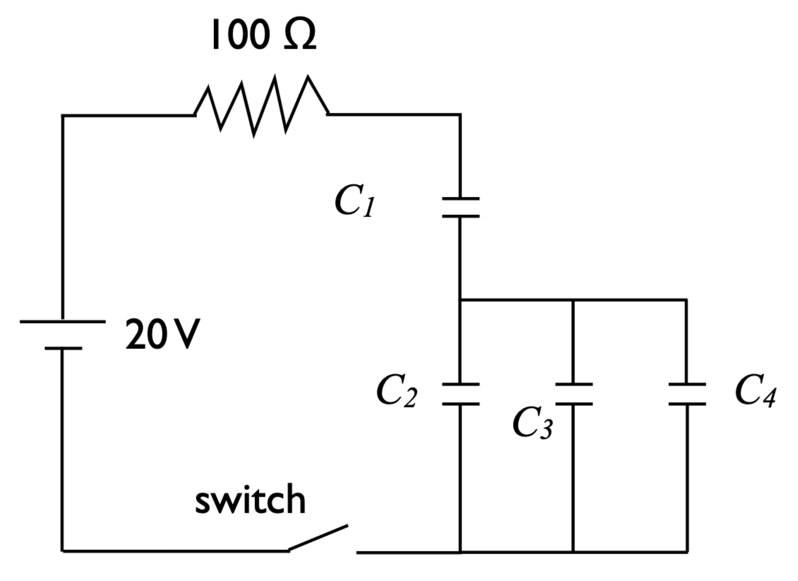

# {{ params.vars.title }}
Consider the RC circuit shown below. Here, $C_1 = {{ params.c1 }}$ $\rm{\mu F}$, $C_2 = {{ params.c2 }}$ $\rm{\mu F}$, $C_3 = {{ params.c3 }}$ $\rm{\mu F}$, and $C_4 = {{ params.c4 }}$ $\rm{\mu F}$.

In this problem we will find the equivalent capacitance of this capacitor system in two steps. We will then use this result to determine the carge stored in the capacitor system.

## Part 1

Select the capacitors that are in parallel with eachother.

### Answer Section

- {{ params.part1.ans1.value }}
- {{ params.part1.ans2.value }}
- {{ params.part1.ans3.value }}
- {{ params.part1.ans4.value }}

## Part 2

Redraw the circuit by replacing the capacitors that you identified in Part 1 by an equivalent capacitor with capacitance $C_5$. Determine value of $C_5$.

Round your answer to three significant figures.

### Answer Section

Please enter an answer in $\rm{\mu F}$.

## Part 3

For your redrawn circuit, select the capacitors that are in series with each other. Do not select any capacitors that you have replaced.

### Answer Section

- {{ params.part3.ans1.value }}
- {{ params.part3.ans2.value }}
- {{ params.part3.ans3.value }}
- {{ params.part3.ans4.value }}
- {{ params.part3.ans5.value }}

## Part 4

Redraw the circuit by replacing the capacitors that you identified in Part 3 by an equivalent capacitor with capacitance $C_6$. Determine the value of $C_6$.

Round your answer to three significant figures.

### Answer Section

Please enter an answer in $\rm{\mu F}$.

## Part 5

Find the time constant $\tau$ for this circuit.

Round your answer to three significant figures.

### Answer Section

Please enter an answer in $\rm{s}$.

## Part 6

Find the maximum charge $Q$ that can be stored in this capacitor system.

### Answer Section

Please enter an answer in $\rm{C}$.

## Attribution

Problem is licensed under the [CC-BY-NC-SA 4.0 license](https://creativecommons.org/licenses/by-nc-sa/4.0/).  