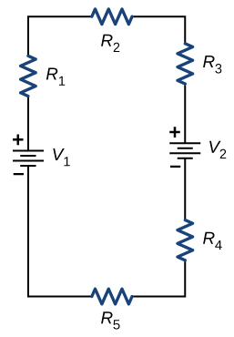

# {{ params.vars.title }}
Consider the circuit shown below.

The battery voltages are $V_1 = {{ params.V1 }}\rm\ V$ and $V_2 = {{ params.V2 }}\rm\ V$.
The resistances are $R_1 = {{ params.R1 }}\rm\ k \Omega$, $R_2 = {{ params.R2 }}\rm\ k \Omega$, $R_3 = {{ params.R3 }}\rm\ k \Omega$, $R_4 = {{ params.R4 }}\rm\ k \Omega$, and $R_5 = {{ params.R5 }}\rm\ k \Omega$.

## Part 1

What is the voltage across $R_1$?

### Answer Section

Please enter in a numeric value in $\rm\ V$.

## Part 2

What is the voltage across $R_2$?

### Answer Section

Please enter in a numeric value in $\rm\ V$.

## Part 3

What is the voltage across $R_3$?

### Answer Section

Please enter in a numeric value in $\rm\ V$.

## Part 4

What is the voltage across $R_4$?

### Answer Section

Please enter in a numeric value in $\rm\ V$.

## Part 5

What is the voltage across $R_5$?

### Answer Section

Please enter in a numeric value in $\rm\ V$.

## Part 6

What is the power supplied to the circuit?

### Answer Section

Please enter in a numeric value in $\rm\ W$.

## Part 7

What is the power dissipated by the circuit?

### Answer Section

Please enter in a numeric value in $\rm\ W$.

## Attribution

Problem is from the [OpenStax University Physics Volume 2](https://openstax.org/details/books/university-physics-volume-2) textbook, licensed under the [CC-BY 4.0 license](https://creativecommons.org/licenses/by/4.0/). 