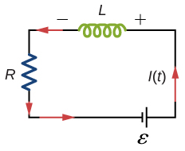

# {{ params.vars.title }}
Consider the $RL$ circuit shown below.

For this question, consider the case that the current has reached its final value of ${\boldsymbol \varepsilon}/R$.

## Part 1

What is the voltage across the inductor?

### Answer Section

Please enter in a numeric value in $\rm\ V$.

## Part 2

Write the voltage across the resistor in terms of the current $I$, inductance $L$, and voltage $\boldsymbol \varepsilon$.

Note that it may not be necessary to use every variable. Use the following table as a reference for each variable:

| For                       | Use |
|---------------------------|-----|
| $I$                       | I   |
| $L$                       | L   |
| $\boldsymbol \varepsilon$ | E   |

### Answer Section

### pl-answer-panel

$V_L = 0 \rm\ V$ 
$V_R = {\boldsymbol \varepsilon} \rm\ V$

## Attribution

Problem is from the [OpenStax University Physics Volume 2](https://openstax.org/details/books/university-physics-volume-2) textbook, licensed under the [CC-BY 4.0 license](https://creativecommons.org/licenses/by/4.0/). 