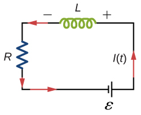

# {{ params_vars_title }}
Consider the $RL$ circuit shown below.

## Question Text

If the emf of the battery is {{ params_word }} by a factor of ${{ params_factor }}$, by how much does the steady-state energy stored in the magnetic field of the inductor change?

### Answer Section

### pl-submission-panel

{{ submitted_answers.part1_ans_str }}

{{ feedback.part1_ans }}

### pl-answer-panel

$\frac{\displaystyle E\_{\rm\ final}}{\displaystyle E\_{\rm\ initial}} =$ {{ correct_answers.part1_ans_str }}

## Attribution

Problem is from the [OpenStax University Physics Volume 2](https://openstax.org/details/books/university-physics-volume-2) textbook, licensed under the [CC-BY 4.0 license](https://creativecommons.org/licenses/by/4.0/). 