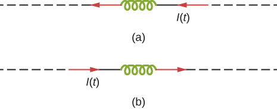

# {{ params_vars_title }}
The current shown below in figure (a) is {{ params_change1 }}, while that shown in part (b) is {{ params_change2 }}.

In each case, determine which end of the inductor is at the {{ params_find }} potential.

## Part 1

Figure (a):

### Answer Section

- {{ params_part1_ans1_value }}
- {{ params_part1_ans2_value }}

## Part 2

Figure (b):

### Answer Section

- {{ params_part2_ans1_value }}
- {{ params_part2_ans2_value }}

## Attribution

Problem is from the [OpenStax University Physics Volume 2](https://openstax.org/details/books/university-physics-volume-2) textbook, licensed under the [CC-BY 4.0 license](https://creativecommons.org/licenses/by/4.0/). 