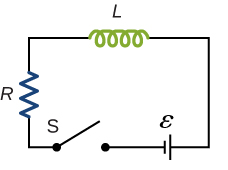

# {{ params.vars.title }}
Consider the $RL$ circuit shown below.

Here, ${\boldsymbol \varepsilon} = {{ params.emf }}\rm\ V$, $L = {{ params.L }}\rm\ mH$, and $R = {{ params.R }}\rm\ \Omega$.

## Part 1

Determine the time constant of the circuit.

### Answer Section

Please enter in a numeric value in $\rm\ s$.

## Part 2

Immediately after switch $\rm S$ is closed, what is the initial current through the resistor?

### Answer Section

Please enter in a numeric value in $\rm\ A$.

## Part 3

What is the final current through the resistor?

### Answer Section

Please enter in a numeric value in $\rm\ A$.

## Part 4

What is the current through the resistor when $t = t^{\star} = {{ params.num }} \tau_L$?

### Answer Section

Please enter in a numeric value in $\rm\ A$.

## Part 5

What is the voltage across the inductor when $t = t^{\star} = {{ params.num }} \tau_L$?

### Answer Section

Please enter in a numeric value in $\rm\ V$.

## Part 6

What is the voltage across the resistor when $t = t^{\star} = {{ params.num }} \tau_L$?

### Answer Section

Please enter in a numeric value in $\rm\ V$.

## Attribution

Problem is from the [OpenStax University Physics Volume 2](https://openstax.org/details/books/university-physics-volume-2) textbook, licensed under the [CC-BY 4.0 license](https://creativecommons.org/licenses/by/4.0/). 