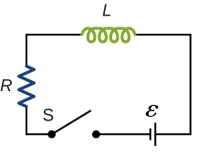

# {{ params.vars.title }}
Consider the $RL$ circuit shown below.

## Question Text

How long after switch $\rm S$ is thrown does it take the current in the circuit to reach $1/{{ params.fac }}$ of its maximum value?
Express your answer in terms of the time constant $\tau_L$ of the circuit.

### Answer Section

### pl-submission-panel

{{ submitted_answers.part1_ans_str }}

{{ feedback.part1_ans }}

### pl-answer-panel

$t =$ {{ correct_answers.part1_ans_str }} $\tau_L$.

## Attribution

Problem is from the [OpenStax University Physics Volume 2](https://openstax.org/details/books/university-physics-volume-2) textbook, licensed under the [CC-BY 4.0 license](https://creativecommons.org/licenses/by/4.0/). 