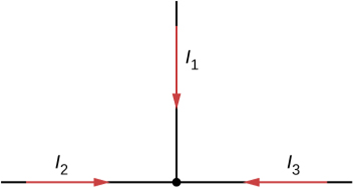

# {{ params.vars.title }}

## Part 1

Can all of the currents going into the junction shown below be positive?

### Answer Section

- {{ params.part1.ans1.value }}
- {{ params.part1.ans2.value }}

By Kirchhoff's junction rule, the sum of the currents flowing into a junction must equal the sum of the currents flowing out of the junction.

## Attribution

Problem is from the [OpenStax University Physics Volume 2](https://openstax.org/details/books/university-physics-volume-2) textbook, licensed under the [CC-BY 4.0 license](https://creativecommons.org/licenses/by/4.0/). 