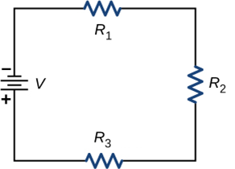

# {{ params.vars.title }}
Consider the circuit shown below.

The terminal voltage of the battery is ${{ params.V }}\rm\ V$ and the resistances are $R_1 = {{ params.R1 }}\rm\ \Omega$, $R_2 = {{ params.R2 }}\rm\ \Omega$, and $R_3 = {{ params.R3 }}\rm\ \Omega$.

## Part 1

Find the equivalent resistance of the circuit.

### Answer Section

Please enter a numeric value.

## Part 2

Find the current through $R_1$.

### Answer Section

Please enter a numeric value.

## Part 3

Find the current through $R_2$.

### Answer Section

Please enter a numeric value.

## Part 4

Find the current through $R_3$.

### Answer Section

Please enter a numeric value.

## Part 5

Find the voltage drop across $R_1$.

### Answer Section

Please enter a numeric value.

## Part 6

Find the voltage drop across $R_2$.

### Answer Section

Please enter a numeric value.

## Part 7

Find the voltage drop across $R_3$.

### Answer Section

Please enter a numeric value.

## Part 8

Find the power dissipated by $R_1$.

### Answer Section

Please enter a numeric value.

## Part 9

Find the power dissipated by $R_2$.

### Answer Section

Please enter a numeric value.

## Part 10

Find the power dissipated by $R_3$.

### Answer Section

Please enter a numeric value.

## Part 11

Find the power supplied by the battery.

### Answer Section

Please enter a numeric value.

## Attribution

Problem is from the [OpenStax University Physics Volume 2](https://openstax.org/details/books/university-physics-volume-2) textbook, licensed under the [CC-BY 4.0 license](https://creativecommons.org/licenses/by/4.0/). 