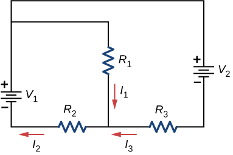

# {{ params.vars.title }}
Consider the circuit shown below.

It is known that $V_1 = {{ params.V1 }}\rm\ V$, $V_2 = {{ params.V2 }}\rm\ V$, $R_1 = {{ params.R1 }}\rm\ \Omega$, $R_2 = {{ params.R2 }}\rm\ \Omega$, and $R_3 = {{ params.R3 }}\rm\ \Omega$.

## Part 1

Find $I_1$.

### Answer Section

Please enter in a numeric value in $\rm\ A$.

## Part 2

Find $I_2$.

### Answer Section

Please enter in a numeric value in $\rm\ A$.

## Part 3

Find $I_3$.

### Answer Section

Please enter in a numeric value in $\rm\ A$.

## Attribution

Problem is from the [OpenStax University Physics Volume 2](https://openstax.org/details/books/university-physics-volume-2) textbook, licensed under the [CC-BY 4.0 license](https://creativecommons.org/licenses/by/4.0/). 