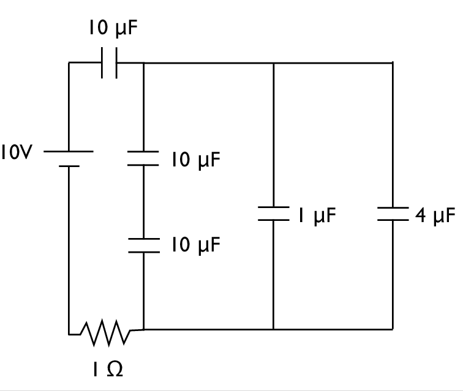

# {{ params.vars.title }}

## Part 1

Identify any capacitors in the circuit shown in figure that are in series or in parallel by circling them with a dashed line and labelling them.

Show a calculation of the effective capacitance of this part of the circuit, and replace the series or parallel capacitors with a single effective capacitor, redrawing the resulting circuit.  On the redrawn circuit repeat this process unit the circuit is fully simplified to a single capacitor, a single resistor and a battery.

Finally, upload your work as a png file named "circuit1"

### Answer Section

File upload box will be shown here.

## Part 2

Find the time constant for this circuit.

### Answer Section

Please enter in a numeric value in {{ params.vars.units }}.

## Part 3

Now step by step rebuild your circuit to find the charge on each capacitor when the capacitors are fully charged (i.e. for $t >> \tau$ after closing the circuit).

Upload your work as a png file named "circuit2"

### Answer Section

File upload box will be shown here.

## Part 4

Find the energy stored on the {{ params.capacitor}} $\mu$F capacitor when it is fully charged.

### Answer Section

Please enter in a numeric value in {{ params.vars.units }}.

## Attribution

Problem is licensed under the [CC-BY-NC-SA 4.0 license](https://creativecommons.org/licenses/by-nc-sa/4.0/).  