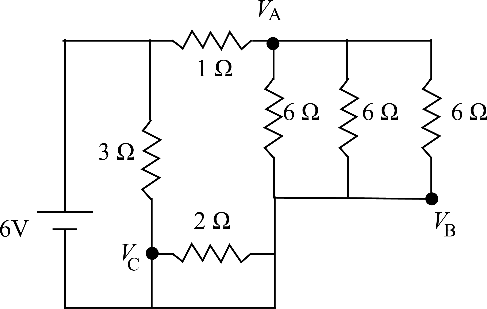

# {{ params.vars.title }}
The figure below shows a resistor circuit.

## Part 1

Find the total resistance of this circuit (in the ideal wire approximation), identifying any resistors in parallel or in series by calculating the effective resistance, reducing the circuit by replacing these resistors with an equivalent resistor and redrawing the circuit until only one resistor remains in the final circuit.
What is the resistance in the final circuit?

### Answer Section

Please enter in a numeric value in {{ params.vars.units }}.

## Part 2

Solve for the potential difference $V_B - V_C$.

### Answer Section

Please enter in a numeric value in {{ params.vars.units }}.

## Part 3

Solve for the potential difference $V_A - V_B$.

### Answer Section

Please enter in a numeric value in {{ params.vars.units }}.

## Attribution

Problem is licensed under the [CC-BY-NC-SA 4.0 license](https://creativecommons.org/licenses/by-nc-sa/4.0/).  