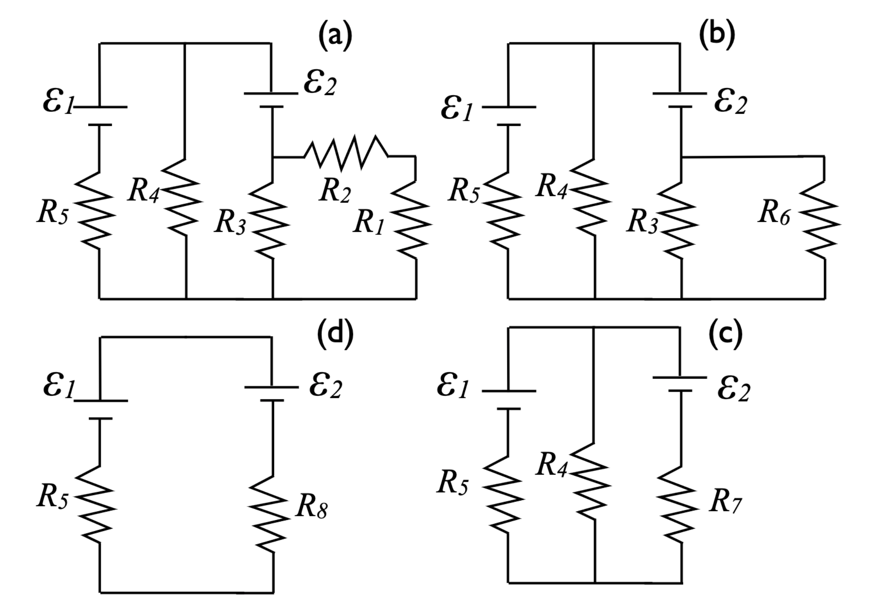

# {{ params_vars_title }}
A car battery charger circuit contains resistors with resistances $R_1 = {{ params_r1 }} \rm{\Omega}$, $R_2 = {{ params_r2 }} \rm{\Omega}$, $R_3 = {{ params_r3 }} \rm{\Omega}$, $R_4 = {{ params_r4 }} \rm{\Omega}$, $R_5 = {{ params_r5 }} \rm{\Omega}$. The circuit is reduced in the steps shown in the figure below.

## Part 1

Select the steps in reducing the circuit that are allowed.

### Answer Section

- {{ params_part1_ans1_value }}
- {{ params_part1_ans2_value }}
- {{ params_part1_ans3_value }}
- {{ params.part1.ans4.value }}

## Part 2

If step **(a)** to **(b)** is allowed, calculate the value of $R_6$. Otherwise enter "-1".

### Answer Section

Please enter an answer in $\rm{\Omega}$.

### pl-submission-panel

{{feedback.part2_ans}}

## Part 3

If step **(b)** to **(c)** is allowed, calculate the value of $R_7$. Otherwise enter "-1".

### Answer Section

Please enter an answer in $\rm{\Omega}$.

### pl-submission-panel

{{feedback.part3_ans}}

## Part 4

If step **(c)** to **(d)** is allowed, calculate the value of $R_8$. Otherwise enter "-1".

### Answer Section

Please enter an answer in $\rm{\Omega}$.

### pl-submission-panel

{{feedback.part4_ans}}

## Part 5

Once the circuit is as simplified as possible, what would you do to find the current through $R_5$?

### Answer Section

- {{ params.part3.ans1.value }}
- {{ params.part3.ans2.value }}

## Attribution

Problem is licensed under the [CC-BY-NC-SA 4.0 license](https://creativecommons.org/licenses/by-nc-sa/4.0/).  