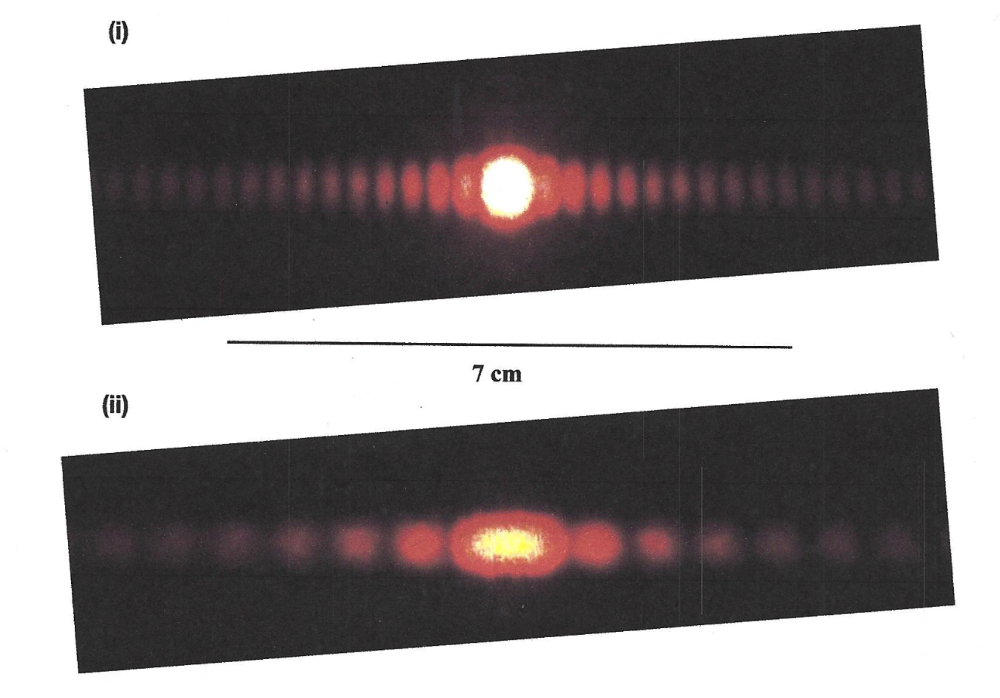

# {{ params.vars.title }}
Photographs of the diffraction of a red laser of wavelength $\lambda = 650$ nm are shown in figures (i) and (ii). A line of length $7$ cm indicates the length scale on the screen.

## Useful Info

When monochromatic light of wavelength $\lambda$ passes through a double slit of separation $d$, <strong>constructive</strong> interference occurs at angles $\theta_m$, where $d\sin\theta_m = m\lambda$  and $m = {0, 1, 2, ...}$ is an integer.  This same relation holds true for light passing through a diffraction grating.  Light passing through a single slit will <strong>destructively</strong> interfere at angles $a\sin\theta_p = p \lambda$, where $p = {1, 2, 3, ..}$ is a non-zero integer and $a$ is the slit width. If a screen is placed at a distance $L$ behind the slit(s)/grating, bright and dark lines are observed at a distance $y$ from the central maximum given by  $y = L\tan\theta$. When the small angle approximation $\theta \approx \sin\theta \approx \tan\theta$ is valid ($\theta \ll 1$ expressed in radians), one expects a double-slit pattern to display equally spaced bright maxima, whereas a single-slit pattern exhibits a central maximum that is twice as wide as the subsequent maxima.

## Part 1

Find the slit width, $a_i$, for pattern (i) (use the small angle approximation if it applies). Express your answer in {{params.vars.units}} to three significant figures. Take the distance you measured on Fig. (i) in Part 2 to be 1.00 cm, and the distance to the screen to be 60.0 cm.

### Answer Section

Please enter in a numeric value in {{ params.vars.units }}.

## Part 2

Find the slit width, $a\_{ii}$, for pattern (ii) (use the small angle approximation if it applies). Express your answer in {{params.vars.units}} to three significant figures. Take the distance you measured on Fig. (ii) in Part 2 to be 2.30 cm, and the distance to the screen to be 60.0 cm.

### Answer Section

Please enter in a numeric value in {{ params.vars.units }}.

## Part 3

Do your answers to part 1 and 2 make sense in terms of which pattern indicated has the larger slit width?

### Answer Section

- {{ params.part3.ans1.value}}
- {{ params.part3.ans2.value}}
- {{ params.part3.ans3.value}}
- {{ params.part3.ans4.value}}
- {{ params.part3.ans5.value}}

## Attribution

Problem is licensed under the [CC-BY-NC-SA 4.0 license](https://creativecommons.org/licenses/by-nc-sa/4.0/).  