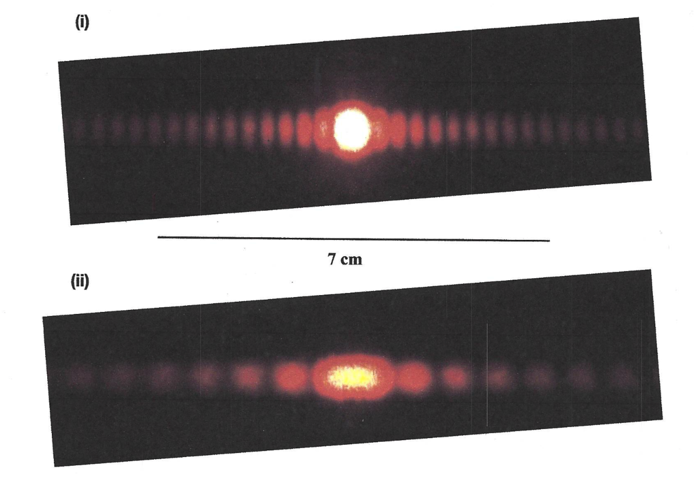

# {{ params_vars_title }}
Photographs of the diffraction of a red laser of wavelength $\lambda = 650$ nm are shown in figures (i) and (ii). A line of length $7$ cm indicates the length scale on the screen.

## Useful Info

When monochromatic light of wavelength $\lambda$ passes through a double slit of separation $d$, <strong>constructive</strong> interference occurs at angles $\theta_m$, where $d\sin\theta_m = m\lambda$  and $m = {0, 1, 2, ...}$ is an integer.  This same relation holds true for light passing through a diffraction grating.  Light passing through a single slit will <strong>destructively</strong> interfere at angles $a\sin\theta_p = p \lambda$, where $p = {1, 2, 3, ..}$ is a non-zero integer and $a$ is the slit width. If a screen is placed at a distance $L$ behind the slit(s)/grating, bright and dark lines are observed at a distance $y$ from the central maximum given by  $y = L\tan\theta$. When the small angle approximation $\theta \approx \sin\theta \approx \tan\theta$ is valid ($\theta \ll 1$ expressed in radians), one expects a double-slit pattern to display equally spaced bright maxima, whereas a single-slit pattern exhibits a central maximum that is twice as wide as the subsequent maxima.

## Part 1

Using a ruler, approximately measure the distance from the middle of the central maximum to the centre of the third dark fringe for figure (i). Measure the line of known length to find the scale factor, and solve for the corresponding distance on the screen of the third dark fringe. Report your answer in cm with two significant figures.

### Answer Section

Please enter in a numeric value in {{ params_vars_units }}.

### pl-submission-panel

{{feedback.part1_ans}}

## Part 2

Using a ruler, approximately measure the distance from the middle of the central maximum to the centre of the third dark fringe for figure (ii). Measure the line of known length to find the scale factor, and solve for the corresponding distance on the screen of the third dark fringe. Report your answer in cm with two significant figures.

### Answer Section

Please enter in a numeric value in {{ params_vars_units }}.

### pl-submission-panel

{{feedback.part2_ans}}

## Attribution

Problem is licensed under the [CC-BY-NC-SA 4.0 license](https://creativecommons.org/licenses/by-nc-sa/4.0/).  