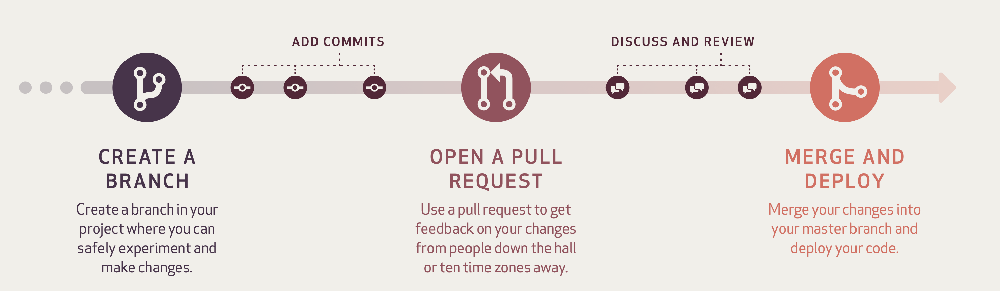

# Authoring Markdown questions in PrairieLearn

Welcome to the Open Problem Bank (OPB) in Physics.
This repository contains the source code (including solutions) to the questions available publicly [here](https://firas.moosvi.com/oer/physicsbank).

## Video Resources

### Introduction

- [Video 1 - Next Generation Problem Bank](https://vimeo.com/559780900)
- [Video 2 - Introduction to Prairie Learn](https://vimeo.com/554493760)
- [Video 3 - Authoring questions for Prairie Learn in Markdown](https://vimeo.com/554494220)

### Authoring Questions Details

- [Video 1 - Overview of Creating PL problems](https://www.youtube.com/watch?v=hFYwxmLDORw&list=PLfhjdV-pwMOa7HeYtI4Qd9QRMPfv77Wamz)
- [Video 2 - Randomizing and solving physics problem in Python](https://www.youtube.com/watch?v=CCnc7bspuZg&list=PLfhjdV-pwMOa7HeYtI4Qd9QRMPfv77Wam&index=2)
- [Video 3 - Writing a Markdown file for a numerical-entry problem](https://www.youtube.com/watch?v=ZoZYZlmvh_Y&list=PLfhjdV-pwMOa7HeYtI4Qd9QRMPfv77Wam&index=3)
- [Video 4 - Fully implemented numeric entry problem](https://www.youtube.com/watch?v=ujCbACEbizA&list=PLfhjdV-pwMOa7HeYtI4Qd9QRMPfv77Wam&index=4)
- [Video 5 - Wrting a symbolic PL problem](https://www.youtube.com/watch?v=P0sK1WS2p98&list=PLfhjdV-pwMOa7HeYtI4Qd9QRMPfv77Wam&index=5)
- [Video 6 - Making a multi-part problem](https://www.youtube.com/watch?v=ftPXBcMCROc&list=PLfhjdV-pwMOa7HeYtI4Qd9QRMPfv77Wam&index=6)

### Useful links

- [Topics, Subtopics, and Learning Outcomes](https://github.com/open-resources/learning_outcomes/blob/main/Masterlist.csv)
- [Public version of the OPB](https://firas.moosvi.com/oer/physics_bank)

## Creating questions on the OPB

### Preamble and guidelines

First some general guidelines:

1. We will be using a [Branch and Pull Request (PR)](https://guides.github.com/introduction/flow/) method to review contributions to the OPB.


Image credit for the above flow is from [GitHub Guides](https://guides.github.com/pdfs/githubflow-online.pdf).

1. Feel free to start a draft pull request while you're working on the question. When you're ready, you can click "ready for review". 

1. You should request reviews from at least two different students on the team.

1. Avoid committing anything to this repository in the `output` directory; the files in there are automatically generated with scripts in the `scripts` directory, using the `source` files.

### Instructions

1. Using the Terminal on your computer, clone this repository locally (i.e. on your computer):

    > `git clone https://github.com/open-resources/instructor_physics_bank.git`

1. Change directory into the `instructor_physics_bank`:

    > `cd instructor_physics_bank`

1. Switch to a new branch (replace `newbranchname` with your question number or description):

    > `git switch -c newbranchname` (the `-c` flag creates a new branch if it does not already exist)

1. Choose a problem that you want to write in markdown, take note of the source, and any attribution you may need to make. Use the [Topics, Subtopics, and Learning Outcomes](https://github.com/open-resources/learning_outcomes/blob/main/Masterlist.csv) file to get the "Topic" and "Subtopic" - you will need to put the question in the correct directory.

1. Create a subdirectory for the question you want to create inside the [`source`](https://github.com/open-resources/instructor_physics_bank/tree/main/source) directory.

    *Note that the directory structure follows the Topic/Subtopic scheme.*

    *If your question title is "Distance Travelled", the equivalent directory name is "distance_travelled" and the file containing the questions should be called "distance_travelled.md".*


    *So the final location of the `distance_travelled.md` should be:*

    > `source/003.Kinematics(1D)/Position/distance_travelled/distance_travelled.md`

1. Copy one of the question templates from the [templates](https://github.com/open-resources/instructor_physics_bank/tree/main/templates) directory into the directory you created in the two steps above. It seems the best way to do this is to copy and paste the file, and then rename it. For our example, that would be the `distance_travelled.md` file.

1. Edit the `distance_travelled.md` file to author your question. Feel free to "commit" to the repository as many times as you like. Here are the commands to first add it to the repository, then commit the file, then push it to GitHub:

    > `git add source/003.Kinematics(1D)/Position/` (if you are confident you only edited your files, you can also do `git add -A` which adds all files or `git add .` which adds all files in this and its children directories)
    > 
    > `git commit -m "A message about a change you made`
    > 
    > `git push`.

    ```{tip}
    [Here's a video demo of the authoring process](https://vimeo.com/554494220).
    ```

1. Open the [instructor_physics_bank](https://github.com/open-resources/instructor_physics_bank) repo on GitHub.com and create a Draft Pull Request (PR). After you push your branch, you should see a green button called "Compare and Pull Request". 

1. When you're ready to have the problem reviewed by others, convert your Draft PR to an actual PR.

1. Add the `syntax check` label to trigger an automatic action to check the syntax of your question. Wait for the action to complete.

1. Verify the question looks and works as expected on [PrairieLearn](https://ca.prairielearn.org/pl/course_instance/2320/instructor/course_admin/questions).

1. Verify the question looks as expected on the [Public version of the OPB](https://firas.moosvi.com/oer/physicsbank).

1. Request one or two reviewers on your problem, wait for their comments and then address them in more commits.

1. Add the `ready_to_merge` label to mark the question as ready to merge into the OPB after all the conversations have been resolved.

1. Switch back to the `main` branch locally:

    > `git switch main`

1. Pull any changes (if there are any):

    > `git pull`

1. Go back to Step 3 to start a new question!

## Responding to reviews and making changes

When a reviewer responds to your pull request and suggests changes, make sure to perform those changes by switching back to this branch by using:

> git switch YourBranchName (you don't need the -c because the branch already exists)

After making the changes, perform the `git add; git commit -m "fixed comments"; git push` commands once more to push the latest changes to the repository and respond to the reviewer.

More details about the [reviewing process can be found here](./reviews.md).