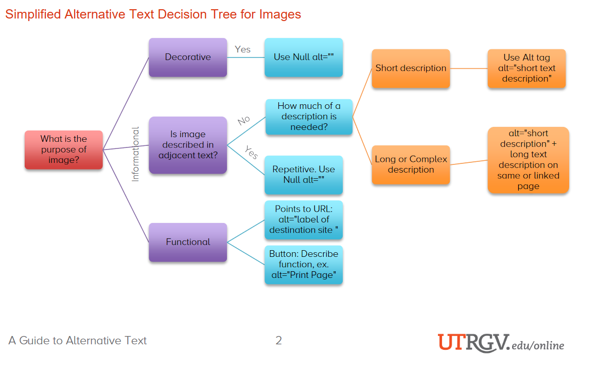
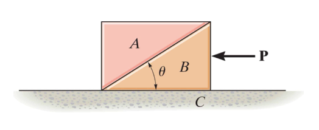

# Guide to Writing Alt-Text 

Alt-text for images are used to describe the content or the functionality within the image without giving away answers or extra clues to the problem.
It should be clear, concise, and convey useful information regarding the content of the image and why it is there rather than simply providing an unnecessary description of what the image is.
For example, ```alt="two square blocks"``` is an example of unhelpful alt-text.  The alt-text should convey what we expect the student to get out of the image.

Here are some questions to guide you when writing alt-text:
- What information will the student miss without the image?
- What is the context?
- Is the information given in the alt-text redundant?

In general, alt-text should be 150 characters or less.
However, for the purpose of the problem bank, more complex and lengthy descriptions might be required. In this case, both alt-text and long descriptions (longdesc) should be used.
The ALT tag is used to provide a short summary of the image content as well as a link to the long description (placed in the same .md file) containing the details.    

The long description will be made available to all students. In doing so, sighted users will also gain a better understanding of the image.

In addition, the University of Texas provides the following guide:



## Adding alt-text to .md files

### Short descriptions

In markdown syntax, alt-text is written between square brackets [ ] preceded by an exclamation point and followed by parenthesis around the image link:

``````

Alternatively, HTML can be used:
`````` 

### Long Descriptions

For long descriptions, an HTML ```<div>``` element with an ```id``` attribute is used. In addition, a ```longdesc``` attribute needs to be added to the `````` element. Using this method also requires indicating the end-point using ```<p>Long description ends.</p>```.

Here is an example of long description for the following image.



Format of the image declaration:
```

```
```Guide to writing alt-text.md``` should be replaced with the name of your .md file. ```#desc``` refers to the ```id``` of the ```<div>``` section.

Format of the ```<div>``` section:
```
<div id="desc">
<h5>Long Description of image: A block acted on by a force P</h5>
Right triangle A is stacked on top of right triangle B to create a rectangular block sitting on top of surface C. The angle between the hypotenuse and adjacent in triangle B is theta. A ninety-degree force P, acting to the left, is applied to the opposite side of triangle B.
<p>Long description ends.</p>
<div>
```

Notice that the alt-text provides all the necessary information to answer the question.

Long descriptions can be added using markdown syntax as well.  This will require nesting the image declaration in a link.

```
[](####longdesc)
```

```
#### <a name="longdesc"></a> Long Description of image: A block acted on by a force P
Right triangle A is stacked on top of right triangle B to create a rectangular block sitting on top of surface C. The angle between the hypotenuse and adjacent in triangle B is theta. A ninety-degree force P, acting to the left, is applied to the opposite side of triangle B.
```

## Mathematical Symbols, Variables, and Tables

For mathematical symbols and equations, the use of Nemeth MathSpeak is recommended. The names of each of the symbols should be spelt out.  Common functions such as trigonometric functions should be written as they typically would in normal speech. Units are intepreted by their name in their plural form. 

### Some common examples in MathSpeak

| Symbol      | MathSpeak | Alternative | 
| ----------- | ----------- | -----------|
| $m_0$      | m sub 0       | |
| $v^2$   | v sup 2        | |
| $-y$ | negative y| |
| $\sqrt{m+n}$ | StartRoot m plus n EndRoot|Root m plus n EndRoot |
| $\sqrt[3]{x} = x^{\frac{1}{3}}$| RootIndex 3 StartRoot x EndRoot equals x Superscript one-third| Index 3 Root x EndRoot equals x Sup one-third |
| $\hat{x}$ | ModifyingAbove x with caret | |
| $\overrightarrow{x+y}$ | ModifyingAbove x plus y with right-arrow | |
| $\overline x$ | x overbar | |
| $\tilde{x}$| x overTilde | |
| $\cos{x}$| cosine x | |
| 1 $J$ = 1 $kg \cdot m^2 \cdot s^{-2}$| 1 joules equals 1 kilograms dot meters squared dot seconds Superscript minus 2| |

Greek letters should be denoted by their Greek names. Here are some examples.

| Symbol      | MathSpeak | 
| ----------- | ----------- | 
| $\alpha$      | alpha       | 
| $\delta$ | delta |
| $\Delta$| Delta|
| $\epsilon$| epsilon|
| $\Epsilon$| Epsilon|
| $\phi$| phi|
| $\Phi$| Phi|

## Tables and Diagrams

### Tables

Images of tables should not be included. Tables should be created using markdown or HTML and such elements do not require alt-text.

### Graphs

These guidelines were taken and adapted from the [Poet Diagram Center](https://poet.diagramcenter.org/how.html#general-guidelines):

- State what type of graph is shown (e.g. scatter, line,...).
- Describe the x-and y-axes and what they represent.
- Write out the points (coordinates) in bullet form.
- Depending on how important the data points are to the central teaching point of the figure, the comma between the x- and y-coordinate may be written out as the word $\textit{comma}$
- As for line graphs, it is not necessary to describe the visual attributes of the lines, unless there is an explicit need such as an exam question referring to these attributes. However, if the line graph has only a few lines, the added description is not a burden to the reader.

### Diagrams

Geometrical diagrams should be described in a linear fashion (e.g. from left to right).  The description should focus on elements not included in the question text such as the data.

#### Circuits

See page 90-91 of [NWEA Image Description Guidelines for Assessments](https://www.nwea.org/content/uploads/2020/12/Image-Description-Guidelines-for-Assessments_IDGA_NWEA.pdf) for an example.

#### Forces on an object 

See page 91-92 of [NWEA Image Description Guidelines for Assessments](https://www.nwea.org/content/uploads/2020/12/Image-Description-Guidelines-for-Assessments_IDGA_NWEA.pdf) for an example.

#### Free Body Diagram 

See page 92-93 of [NWEA Image Description Guidelines for Assessments](https://www.nwea.org/content/uploads/2020/12/Image-Description-Guidelines-for-Assessments_IDGA_NWEA.pdf) for an example.

#### Energy

See page 93-94 of [NWEA Image Description Guidelines for Assessments](https://www.nwea.org/content/uploads/2020/12/Image-Description-Guidelines-for-Assessments_IDGA_NWEA.pdf) for an example.

#### Waves

See page 94-96 of [NWEA Image Description Guidelines for Assessments](https://www.nwea.org/content/uploads/2020/12/Image-Description-Guidelines-for-Assessments_IDGA_NWEA.pdf) for an example.

#### Systems - Levers

See page 96-97 of [NWEA Image Description Guidelines for Assessments](https://www.nwea.org/content/uploads/2020/12/Image-Description-Guidelines-for-Assessments_IDGA_NWEA.pdf) for an example.

#### Systems - Pulleys

See page 97-98 of [NWEA Image Description Guidelines for Assessments](https://www.nwea.org/content/uploads/2020/12/Image-Description-Guidelines-for-Assessments_IDGA_NWEA.pdf) for an example.

## For more information

[NWEA's Image Description Guidelines for Assessments](https://www.nwea.org/content/uploads/2020/12/Image-Description-Guidelines-for-Assessments_IDGA_NWEA.pdf) provides a comprehensive guide to writing alt-text. Reading Chapter 2, *General Guidelines for Image Descriptions*, is recommended.  

## Sources

- [A Guide to Alternative Text - UTRGV](https://www.utrgv.edu/eolc/_files/2017/posters/handouts/a-guide-to-alternative-text.pdf). Retrieved June 12, 2021.
- [Canvas - Equations](https://learn.canvas.net/courses/831/pages/equations "Canvas"). Retrieved June 13, 2021.
- [MathSpeak Grammar Rules](https://www.seewritehear.com/accessible-mathml/mathspeak/examples/grammar-rules/). Retrieved June 13, 2021.
- [HOW To Describe Images](https://poet.diagramcenter.org/how.html#general-guidelines). Retrieved June 13, 2021.
- [NWEA Image Description Guidelines for Assessments](https://www.nwea.org/content/uploads/2020/12/Image-Description-Guidelines-for-Assessments_IDGA_NWEA.pdf). Retrieved June 13, 2021.
- [Making Images Accessible](https://www.washington.edu/accessibility/checklist/images/). Retrieved June 19, 2021.
- [Tools for Images](https://learn.canvas.net/courses/831/pages/tools-for-images). Retrieved June 19, 2021.
