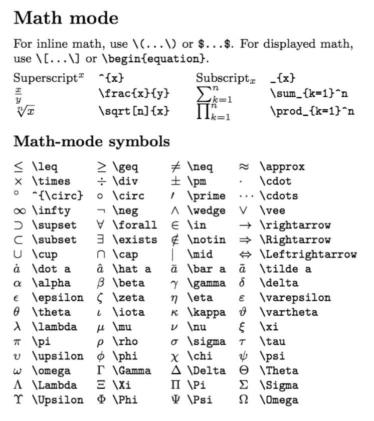

# Using LaTeX in problems

## What is LaTeX?

LaTeX is a markup language that allows you to format the appearance of a document using specific syntax.
In our project you will mostly be using it to typset mathematical formulas. Markdown supports LaTeX, you just need to surround it with `$___$`.

## Table of Math Symbols

Here is a table of the main mathematical symbols you will be using.


Image credit for the above table is from [Winston Chang](https://github.com/wch/latexsheet/blob/ef6d3f438c0e2e5499ffbe79a4be21960c9b3b07/latexsheet.pdf).

## Examples

To capitalize a greek letter, you just need to capitalize the first letter of it in LaTeX.

Ex:

> \alpha and \Alpha

To create a fraction of LaTeX symbols, you can simply insert the symbols you need into the fraction function

Ex:

> \frac{\alpha}{\theta\pi}

You can add LaTeX anywhere into your markdown code, as long as you surround it with $...$

> The block travels on an incline of 30$^{\circ}$.

For superscripts:

> $3^4$ should be \$3^4\$

> $3^{-4}$ should be \$3^{-4}\$ since more than one character is being used in the superscript

## Additional Resources

For a more thorough collection of LaTeX syntax, [click here.](https://github.com/wch/latexsheet/blob/ef6d3f438c0e2e5499ffbe79a4be21960c9b3b07/latexsheet.pdf)

## Issues with rendering LaTeX

There are two locations in an `.md` question file to add LaTeX: in the YAML header, or in the markdown portion.
There are separate issues and resolutions depending on where the LaTeX is entered, so this section is split into two.

### LaTeX in the Markdown portion

LaTeX code might sometimes not render properly on PL.
Most of the time, using two back slashes instead of one will solve the issue.

Some examples:

| Issue | Fix |
| -- | -- |
| `\frac{}{}` | Use `\dfrac{}{}` or `\\frac{}{}`|
| `\theta` | `\\theta` |
| `\vec{}` | `\\vec{}` |

Furthermore, if adding the extra back slash does not work, separating the LaTeX elements into different strings and then applying concatenation might fix the problem.

### LaTeX in the YAML header

#### Storing and displaying answers with LaTeX elements

Let's assume that we have two variables `t1` and `t2`  which are used to generate different answers each time a new variant of a question is created.
The answers need to look like this eventually : $\Delta_{v_{ t1 \to t2}}$.

For example, if `t1 = 3` and `t2 = 5`, the answer option would be $\Delta_{v_{ 3 \to 5}}$.

Instead of using

```
r"$\Delta v_{" + str(t1) + r"\to" + str(t2) + r"}$"
```

to create the answer string, a combination of f-strings and raw-strings can be used to simplify the expression and to increase readability:

```
rf"$\Delta v_{{ {t1} \to {t2} }}$"
```

The variables need to be enclosed by a set of curly braces. 
In addition, the curly braces needed by LaTeX need to be doubled to 'escape' them.
