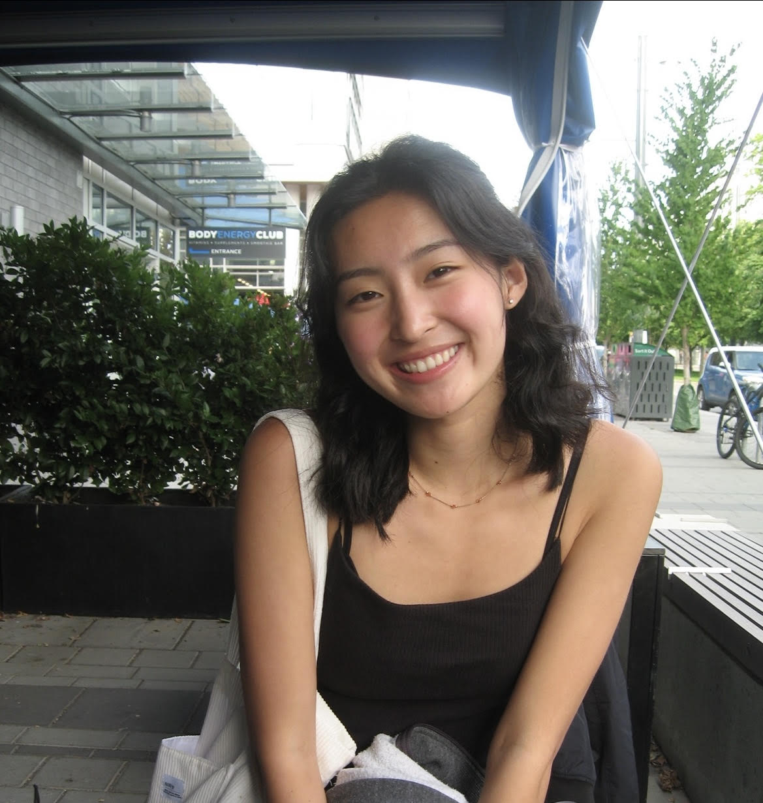
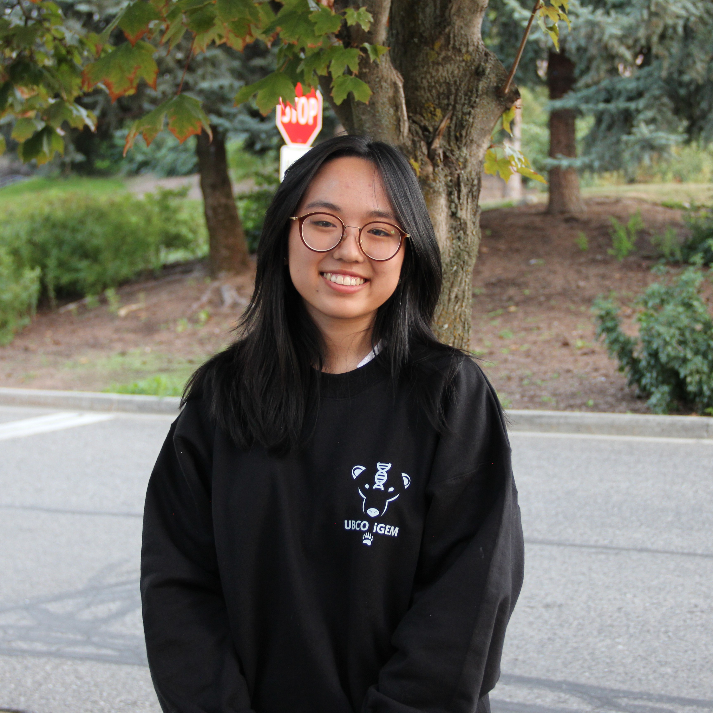
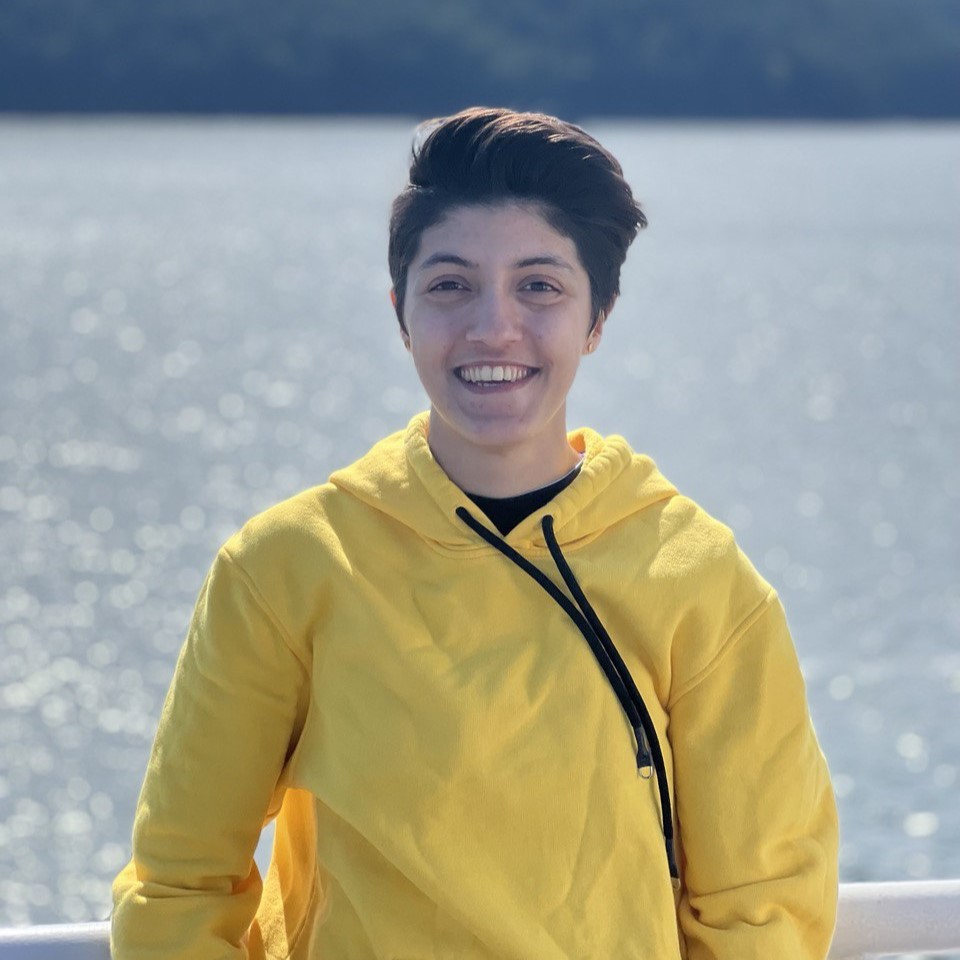
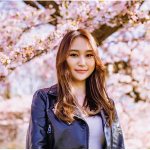

# Title

## Open Physics Problem Bank Project Team Members

| Name             | GitHub handle  |
|------------------|----------------|
| Firas Moosvi     | firasm         |
| Jake Bobowski    | jake-bobowski  |
| Ava Cornell      | ahcornell      |
| Abby Kiehlbauch  | abbykiehlbauch |
| Maya Patel       | maya-patel     |
| Akshat Poddar    | akshatpoddar   |
| Parsa Rajabi     | Parsa-Rajabi   |
| James Ropotar    | JamesShadowfyre|
| Vanshika Sharma  | vanshika151    |
| Joseph Wandinger | Bizwatch-UBC   |
| Paula Wong-Chung | KafkaNoNeko    |
| Edris Wu         | edriswu        |
| Graham Bovett    | gbovett        |
| Stephen Collins  | SteveCollins17 |
| Alyssa Kong      | naclsodium     |
| Anna Cao       | annascao       |
| Muneeba Ashiq    | muneebaashiq   |
| Larita Kipkeu    | kipkeu         |
| Mrunal Last??    | Moon0256       |
| Skyler Sattarifard | certainlyskyler|

## Bios

### Principal Investigators

 </img>

#### **Dr. Firas Moosvi**

Firas Moosvi is a Lecturer at UBC Okanagan in the Computer Science, Math, Physics, and Statistics department. He teaches courses in Physics, Data Science, and Computer Science at the undergraduate and graduate levels. He has many research interests and they fall under three main umbrellas: medical imaging for applications in cancer, scholarship of teaching and learning (SoTL), and learning analytics. Most recently, he is looking at how the field of learning analytics can provide insight to surface and reduce inequities in STEM programs. Firas has a deep appreciation for data visualization, active learning, and open source projects.   

 </img>

#### **Dr. Jake Bobowski**

Jake is a Professor of Teaching in physics at UBC Okanagan.  In addition to teaching and Physics Education Research, he is interested in applying microwave techniques to study condensed matter systems.      

### Undergraduate students

 </img>

#### **Mrunal Last??**

I am a second year student at UBC Okanagan. I am planning to major in Computer Science with a minor in Mathematics.

I am really excited to be a part of this team and work on this project. The courses that I had taken with Dr. Moosvi were not stressful at all because of the how the courses were set with PraireLearn. To now be a part of the team working on expanding and enhancing the Open Problem Bank is a dream come true. I am really grateful to be able to have the opportunity to  enhance the experience of future students. 

Aside from academia, I usually rewatch sitcoms, Modern Family, The Big Bang Theory and Brooklyn Nine-Nine are my favorites. I also like to improve and expand my speedcubing skills. I also like to collect logos. I have also recently started roaming/hiking around the campus and academy hill and it has been awesome.    

 </img>

#### **Larita Kipkeu**

I'm a third-year electrical engineering student. My true passion lies in creating sustainable and inclusive designs that can have a positive impact on communities. I firmly believe that through my work, I can contribute to making the world a better place.

One of the things I absolutely love is collaborating with diverse teams. There's something truly magical about working with people from different backgrounds and hearing their unique perspectives. I find immense value in learning from others and appreciating the wide range of viewpoints that come together to create innovative solutions.

When I have some free time, you'll often find me exploring new places, especially nature trails and hiking spots. Being out in nature allows me to disconnect from the hectic world and find inspiration in its breathtaking beauty. These experiences rejuvenate my mind and provide me with fresh ideas and insights that I can bring into different things I partake in.    

 </img>

#### **Muneeba Ashiq**

I am going into my third year at UBC-Vancouver and am specializing in Computer Science. I am quite passionate about making changes in the education industry to make it more accessible to others hence believe that working on this project with all of you will be a great step in that direction.

Some fun facts about me are that I can speak four languages fluently, am quite extroverted and love to talk to new people find out more about their opinions and ideas. Another thing about me is that I started my degree at UBC-O but transferred to UBC-V last summer so I have experienced life at both campuses. I am very excited to get to know everyone and learn from them.    

 </img>

#### **Anna Cao**

I am a second-year Electrical Engineering student at UBC Vancouver. I have a passion for both hardware and software, and I enjoy integrating them into advanced technologies and systems that have a positive impact on people's lives. I’m excited to be part of a project that fosters accessible education and supports students, while also providing an opportunity to collaborate with others and enhance my technical skills. When I'm not studying, I like to ski in the winter or enjoy the lake and paddleboard in the summer. I also love playing piano, and all things art!    

 </img>

#### **Alyssa Kong**

I am a fourth year student completing a  Microbiology degree at UBC Okanagan. Despite being a Microbiology major, I have taken quite a few computer science electives and a data science elective as I have seen an increasing need for these skills within biological sciences! Currently, I am mentoring the 2023 UBCO International Genetically Engineered Machine Competition team, and last year was involved in kickstarting the first team on the Okanagan Campus, leading the team to Gold in Paris! Seeing the importance of dry lab work during the synthetic biology competition, and my background in biological sciences, I am hoping to provide a unique perspective and add to the multi-disciplinary nature of the team!    

 </img>

#### **Skyler Sattarifard**

I am a second year, intending to specialize in computer science. The two things I love the most are helping and learning and that is why I'm here. I'm particularly enthusiastic about Prairelearn because it's open source and free, way better those paid websites with mandatory textbooks. I generally like tv-shows (big fan of game of thrones), hiking, and exploring, and you can usually find me in UBC Okanagan's library.    

 </img>

#### **Ava Cornell**

I am a fourth year honours physics student at UBC Okanagan. Throughout my degree, I have thoroughly enjoyed being a physics teaching assistant and tutor, which has caused me to develop an interest in making learning more accessible and less stressful for students. In my free time, I like to hike, camp, and socialize.    

 </img>

#### **Abby Kiehlbauch**

I am a first year Bachelor of Arts student at UBCO planning to major in Computer Science. As it is my first year I don't have a specific area of interest, however my passions have always been mental health advocacy and social justice - I hope to find a way in which Computer Science can elevate those two fields. I am looking forward to further exploring the field of Computer Science in my next three years at UBCO. While I'm not studying or spending my days on Zoom I am usually reading, sewing, crocheting, or baking!    

 </img> 

#### **Maya Patel**

I am a third year physics student at UBCO. I am passionate about physics education and hoping to pursue a masters after I graduate. I have always loved teaching and I was excited about this opportunity to make physics education more accessible. When I am not studying, you can find me hiking, skiing or rock climbing.    

 </img> 

#### **Akshat Poddar**

I am a 2nd year undergraduate student at UBC. My interests lie in the fields of Computer Science and Mathematics and I spend my time making myself more proficient in these disciplines. When I am not busy learning new technologies and frameworks, I spend most of my time on YouTube. I love to sing, cruise around on my skateboard, and enjoy a good game of the Settlers of Catan.     

 </img>

#### **Parsa Rajabi**

I am a 5th year Computer Science student with a background in Project Management, DevOps, Software Development, and research. I have a strong passion for Computer Science Education, Computational Thinking within K-12 Education and Human-Computer Interaction (HCI). Aside from doing research and teaching, I spend my spare time cooking, traveling, hiking and volunteering in the community / on campus!

[ LinkedIn](https://www.linkedin.com/in/parsa-rajabi/)    

 </img>

#### **James Ropotar**

I am a second year UBC Okanagan student studying Manufacturing Engineering. I have a particular interest in teaching, and exploring new ways to develop methods to teach complex topics. I am extremely curious, always putting myself out to learn new things. My life goal is to be able to help everyone reach their highest potential as learners. I spend my free time writing, mapping, and doing other creative works. 
   

 </img>

#### **Vanshika Sharma**

I am a third year combined honours physics and astronomy student at UBC. Having taught science and math to special needs students over the past couple of years, I have developed a profound interest in science education and specifically making learning more accessible. Therefore, I am both excited and honoured to be part of this project! Academically, my interest lies in astrophysics but apart from that you can catch me hiking, food hopping, rewatching the same five tv shows or at the gym.     

 </img>

#### **Joseph Wandinger**

I am a fifth-year B.Sc. student at UBC Okanagan pursuing honours in physics and a minor in mathematics. I have always been passionate about making physics education more accessible to everyone, so I am excited to be a part of this project. In my research and honours thesis, I have investigated mid-range wireless power transfer using inductively-coupled loop-gap resonators. Outside of my academic pursuits, I am a student pilot of fixed-wing aircraft and I am pursuing my private pilot licence. In my spare time, I enjoy waterskiing, snowboarding, and playing music.    

 </img>

#### **Paula Wong-Chung**

I am a second-year Computer Science major at UBCO.  While I currently do not have any particular area of interest, my focus is on the intersection of Mathematics and Computer Science.  I enjoy trying out new things and challenging myself.   I spend my spare time listening to music, drawing, and looking for new stories to immerse myself in.    

 </img>

#### **Edris Wu**

I am a third year UBC student majoring in Cognitive Systems. My interests are mainly in computer science and psychology. I am interested in understanding the brain's role in cognitive processes and perception, I also enjoy coding and learning about artificial intelligence as well as human computer interaction. In my spare time I enjoy going on walks with my dog, trying new foods, and listening to podcasts.
   

 </img>

#### **Graham Bovett**

I am a 3rd year Comp Sci student at UBCO. I am looking forward to specializing in AI and machine learning in my future courses and through co-op placements. Outside of school, I enjoy hiking, camping, snowboarding, and sailing.    

### Graduate students

 </img>

#### **Stephen Collins**

I am a PhD candidate in medical physics here at UBCO. My research is in iterative image reconstruction methods for optical CT radiochromic gel dosimetry. Outside of my research I enjoy hockey, golf and snowboarding.    

 </img>

#### **Michael Kudla**

I am a PhD student in MedPhys. I am developing a patient specific technology suite for low cost imaging and surgical tool manufacturing (3D printed) for treatment of gynecological malignancies. I am into rock climbing and ski-touring.    

