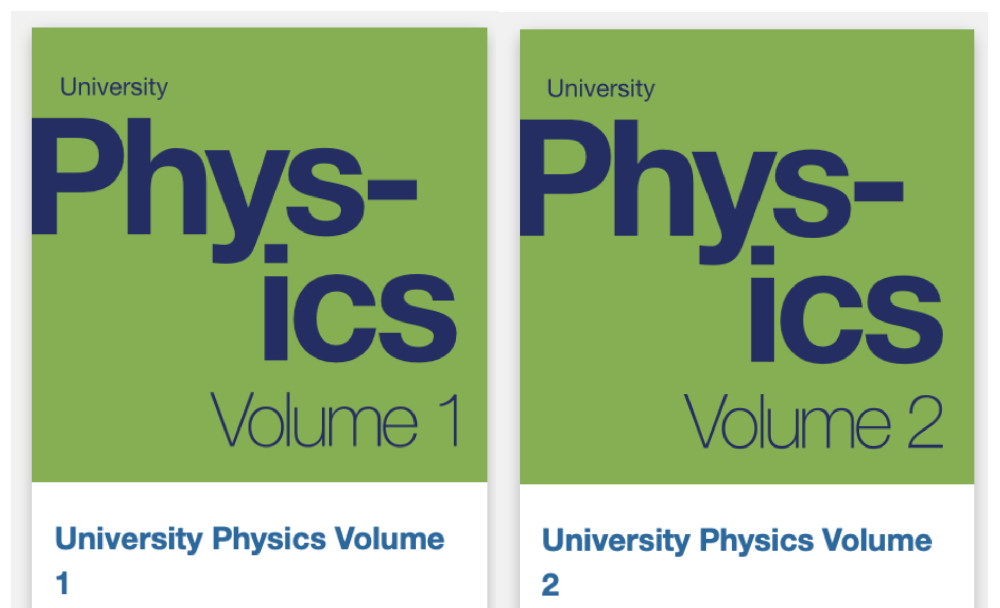
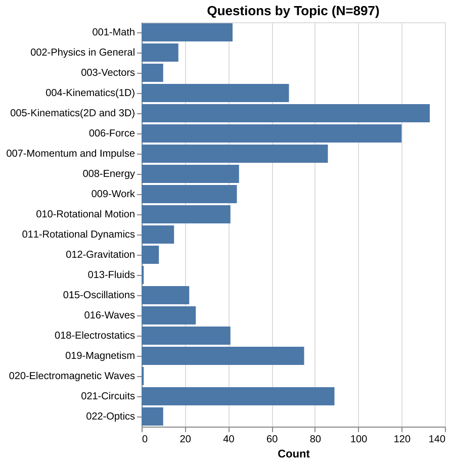

# Open Problem Bank in Physics (OPBP)

This open problem bank is intended for use in an undergraduate, calculus-based first-year physics course.
Questions from the bank have been contributed by various instructors at UBC, as well the [OpenStax University Physics (Volume I and II) textbooks](https://openstax.org/subjects/science).
All questions are shared under an Creative Commons license.

## Questions by Topics

Here are the questions in the bank split by Topics.

## Usage

## Acknowledgements

The logo of this site is the [Svalbard Global Seed Vault](https://commons.wikimedia.org/wiki/File:Entrance_to_the_Seed_Vault_(cropped).jpg) and the image is licensed under the [Creative Commons](https://en.wikipedia.org/wiki/en:Creative_Commons) [Attribution-Share Alike 4.0 International license](https://creativecommons.org/licenses/by-sa/4.0/deed.en).
